# FoodExpress - Food Retailer

## Customer Segmentation for Marketing Strategy

Photo by <a href="https://unsplash.com/@_staticvoid?utm_source=unsplash&amp;utm_medium=referral&amp;utm_content=creditCopyText">Lucas Santos</a> on <a href="https://unsplash.com/s/photos/supermarket?utm_source=unsplash&amp;utm_medium=referral&amp;utm_content=creditCopyText">Unsplash</a>

# 1.0 The context

Marketing is crucial for the growth and sustainability of any business. It can help build the company’s brand, engage customers, grow revenue, and increase sales.

One of the **key pain points** for a marketing team is to know their customers and identify their needs. By understanding the customer, the team can launch a targeted marketing campaign that is tailored for specific needs. In addition, if data about the customers is available, the data science team can help performing a **customer segmentation**.

## 1.1 What Is Customer Segmentation?

Customer segmentation is the process of dividing a target market into smaller, more defined categories. It segments customers and audiences into groups that share **similar characteristics** such as demographics, interests, needs, or location.

Companies employing customer segmentation operate under the fact that every customer is different and that their marketing efforts would be better served if they target specific, smaller groups with messages that those consumers would find relevant and lead them to buy something. Companies also hope to gain a **deeper understanding** of their customers' preferences and needs with the idea of discovering what each segment finds most valuable to **more accurately** tailor marketing materials toward that segment.

PS 1: All the references are stated at the end of this README.

PS 2: You can find useful information at **section 1** of my [notebook](https://github.com/brunokatekawa/food_retail_clustering/blob/main/02_iFood_Mkt_Clustering.ipynb).

 

# 2.0 The challenges

FoodExpress is a well-established company operating in the retail food sector. Presently they have around several hundred thousand registered customers and serve almost one million consumers a year. They sell products from 5 major categories: wines, rare meat products, exotic fruits, specially prepared fish and sweet products. These can further be divided into gold and regular products. The customers can order and acquire products through 3 sales channels: physical stores, catalogs and company’s website. Globally, the company had solid revenues and a healthy bottom line in the past 3 years, but the profit growth perspectives for the next 3 years are not promising... For this reason, several strategic initiatives are being considered to invert this situation. **One is to improve the performance of marketing activities, with a special focus on marketing campaigns**. Moreover, other than maximizing the profit of the campaign, the CMO is interested in understanding to **study the characteristic features of those customers who are willing to buy the gadget**.

For the data set and more info about the case [click here](https://github.com/ifood/ifood-data-business-analyst-test).

 

# 3.0 The solution

In this project, I manage to build a clustering model that intakes data from customers, clusters them into **five different groups** and extracts their main characteristics in order to **prescribe a business marketing strategy**.

(Wait until the gif starts.)

 

## 3.1 What drove the solution

### 3.1.1 Exploratory Data Analysis

#### Descriptive Analysis

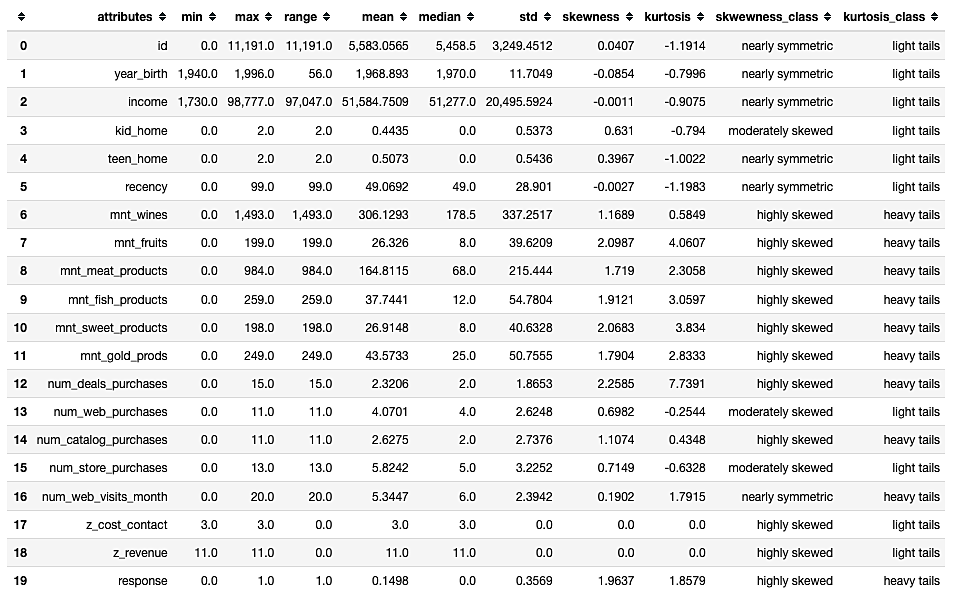

Key points:

- The **oldest** person was born in **1940**.
- The **youngest** person was born in **1996**.
- The **average income is $51,596.39**.
- People have at **maximum 2 kids** at home.
- People have at **maximum 2 teens** at home.
- The **average recency is 49 days** while the maximum is 99 days.

 

#### Hypothesis Map

This map to help us to decide which variables we need in order to validate the hypotheses.

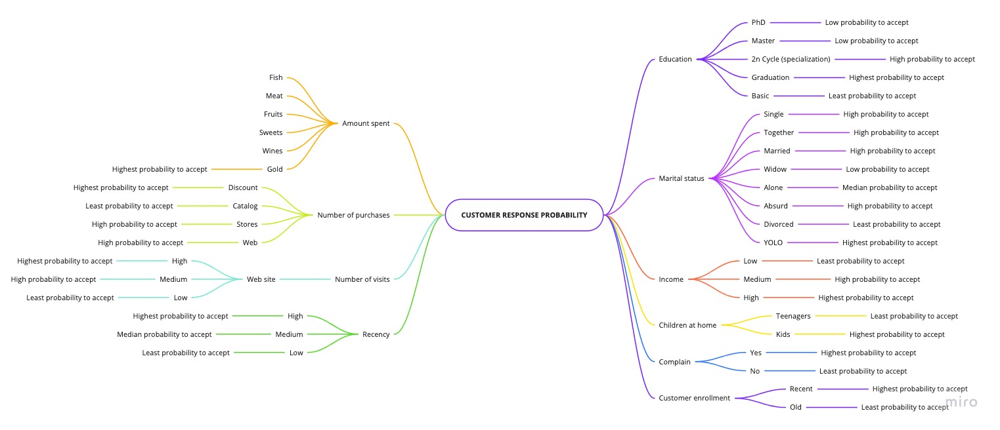

#### Univariate Analysis - Responses (target)

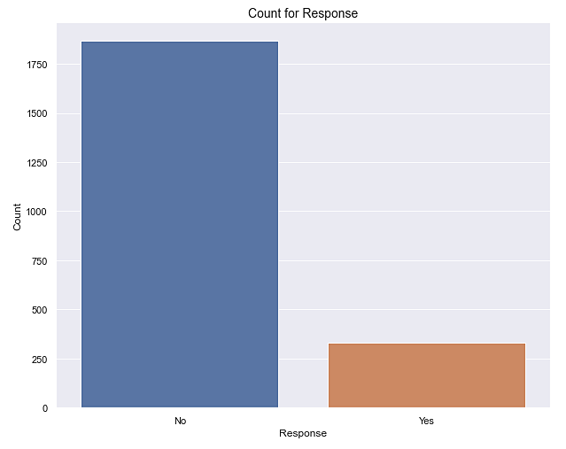

Number of yes: 329 (14.98% of the total responses)
Number of no: 1867 (85.01% of the total responses)

 

#### Univariate Analysis - Numerical

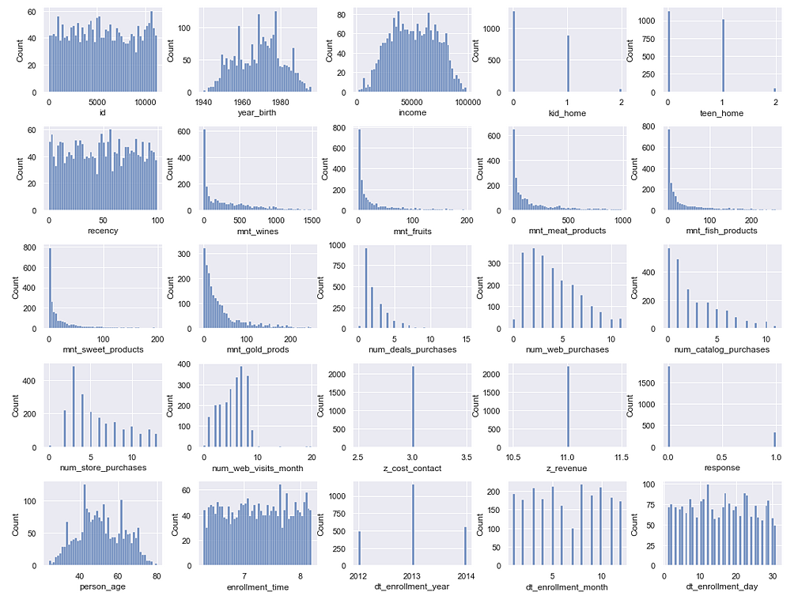

Key points:

- Most people were born between 1960 and 1980.
- Most people have income between 25k and 75k.
- Almost no one have kids neither teenagers at home.
- There are all sorts of recency.
- Big portion of people spend up to:
  - 500 on wine
  - 250 on meat
  - 50 on fruits
  - 50 on fish
  - 50 on fruits
  - 75 on gold products
- Big portion of people make purchases up to:
  - 5 with discount
  - 7 through company's web site
  - 6 using catalog
  - 7 directly in stores
- 5 to 10 visits to company's website were the number that most people made.
- Most people enrolled on 2013.
- July is the month with least enrollments.

 

#### Univariate Analysis - Categorical

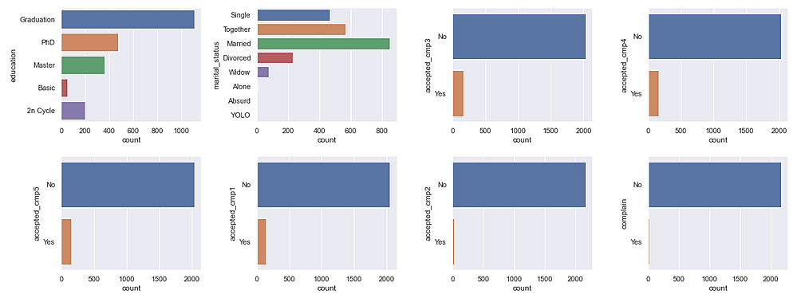

Key points:

- There more people holding a graduate degree.
- There are more people that are married.
- The big majority of people tend to not accept the offer.

 

### 3.1.2 Hypothesis validation - Bivariate Analysis

#### Main Hypothesis

##### H1 People with graduate degree tend to accept more. (TRUE)

##### H2 People with basic degree tend to be the least to accept. (TRUE)

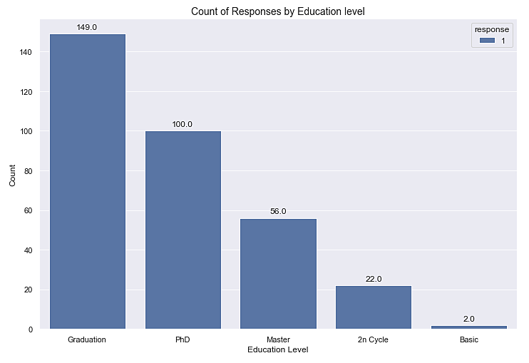

As observed, people with graduate degree tend to accept more while people with basic degree tend to be the least to accept.

> Thus, the hypotheses are **TRUE**.

#### H3 People on YOLO tend to accept more. (FALSE)

#### H4 People on divorced tend to be the least to accept. (FALSE)

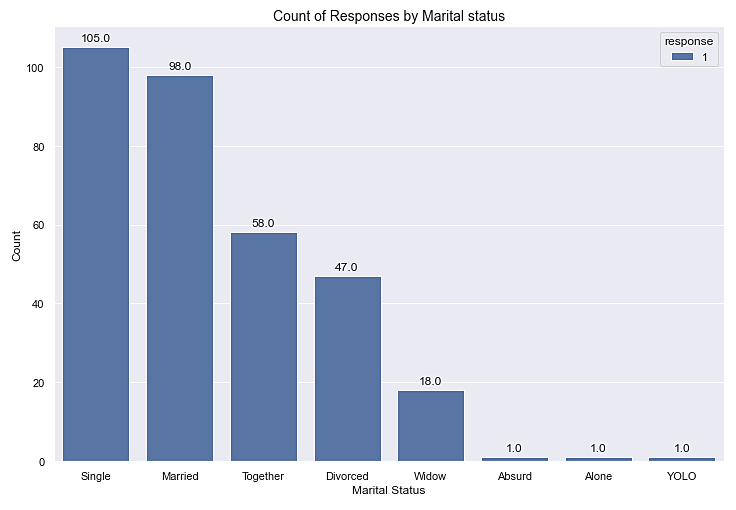

As observed, single people tend to accept more and people on absurd, alone or YOLO tend to be the least.

> Thus, the hypotheses are **FALSE**.

#### H5 The higher the income, the higher is the tendency to accept. (FALSE)

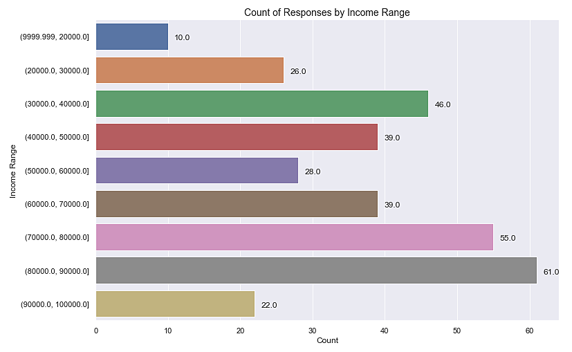

As observed, although the tendency to accept is higher among \$80k and $90k, it's not valid for all income levels.

> Thus, the hypothesis is **FALSE**

#### H6 People that have more teenagers tend to accept less. (TRUE)

#### H7 People that have more kids tend to accept less. (TRUE)

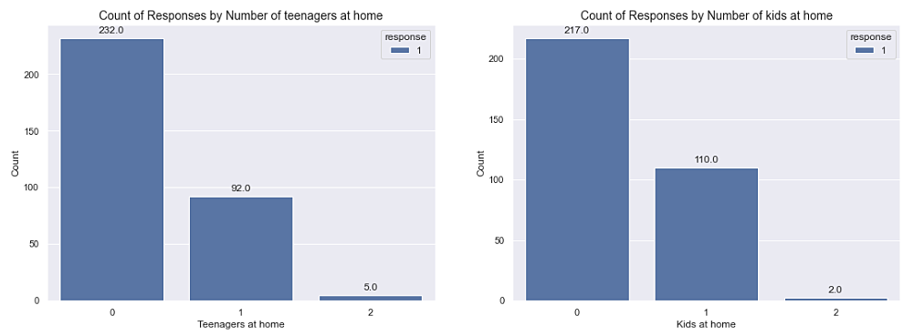

AS observed, the higher the number of kids, the lesser is the tendency to accept.

> Thus, the hypotheses are **TRUE**.

#### H13 The higher the number of visits to the web site, the higher is the tendency to accept. (FALSE)

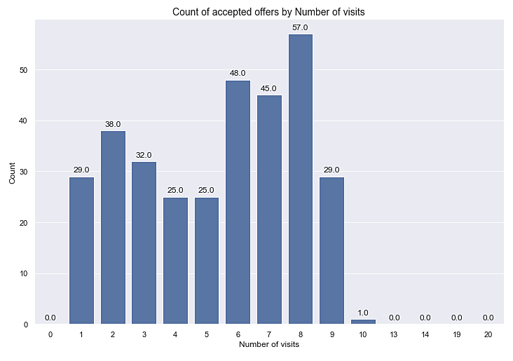

As observed, higher number of visits doesn't necessary means a higher tendency of offer acceptance.

> Thus, the hypothesis is **FALSE**.

 

#### Hypothesis summary

| ID  | Description                                                                                                                                          | Conclusion |
| :-: | :--------------------------------------------------------------------------------------------------------------------------------------------------- | :--------- |
| H1  | People with graduate degree tend to accept more                                                                                                      | True       |
| H2  | People with basic degree tend to be the least to accept                                                                                              | True       |
| H3  | People on YOLO tend to accept more                                                                                                                   | False      |
| H4  | People on divorced tend to be the least to accept                                                                                                    | False      |
| H5  | The higher the income, the higher is the tendency to accept                                                                                          | False      |
| H6  | People that have more teenagers tend to accept less                                                                                                  | True       |
| H7  | People that have more kids tend to accept less                                                                                                       | True       |
| H8  | People who complain tend to be the least to accept                                                                                                   | True       |
| H9  | The more recent a person enrolled the higher is the tendency to accept                                                                               | False      |
| H10 | The total amount spent in gold products by all people who accepted is larger than the total amount spent in gold products by all people that refused | False      |
| H11 | The total amount spent in products by all people who accepted is larger than the total amount spent in products by all people that refused           | False      |
| H12 | The total number of purchases by all people who accepted is larger than the total number of purchases by all people who refused                      | False      |
| H13 | The higher the number of visits to the web site, the higher is the tendency to accept                                                                | False      |
| H14 | The higher the number of days since the last purchase, the lower is the tendency to accept                                                           | True       |

 

### 3.1.3 Machine Learning

**Algorithm used:** K-Means with 5 clusters.

#### Performance Metrics

| Metric            |     Score |
| ----------------- | --------: |
| Silhouette        |   0\.1320 |
| Davies Bouldin    |   2\.0756 |
| Calinski Harabasz | 407\.5665 |

#### Visualizing the clusters

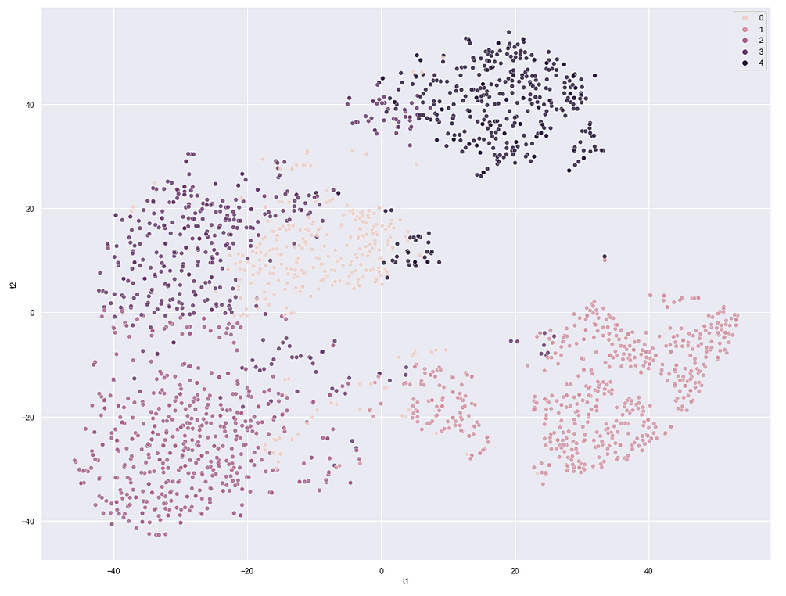

(Wait until the gif starts.)

 

## 3.2 Business Performance

### Profiling the clusters

**General characteristics**
| cluster | mnt_meat_products | mnt_fish_products | mnt_wines | num_catalog_purchases | num_store_purchases | income | n_customers |
|----|----------|----------|----------|--------|--------|-------------|-----|
| 0 | 76\.07 | 18\.68 | 258\.87 | 1\.94 | 6\.11 | 55,066\.03 | 318 |
| 1 | 27\.83 | 9\.84 | 36\.06 | 0\.55 | 3\.19 | 29,603\.02 | 576 |
| 2 | 469\.73 | 102\.72 | 609\.16 | 6\.00 | 8\.46 | 76,345\.70 | 508 |
| 3 | 181\.19 | 42\.63 | 580\.26 | 3\.81 | 8\.36 | 60,306\.24 | 405 |
| 4 | 24\.94 | 4\.70 | 63\.52 | 0\.63 | 3\.41 | 39,871\.81 | 389 |

 

### CLUSTER 0:

- **Least number of customers.**
- Relatively large number of purchases through stores.
- Relatively large amount spent on wine products
- Median income.
- **Don't make much catalog purchases.**

### CLUSTER 1:

- **Lowest income.**
- **Largest number of customers.**
- Not used to make catalog purchases.
- **Least amount spent on wine products.**

### CLUSTER 2:

- **Highest income.**
- **Largest amount spent on all products.**
- **Largest amount on purchases.**
- Relatively moderate number of customers.

### CLUSTER 3:

- Large amount spent on meat products.
- Large amount spent on wine products.
- Spends moderate amount on fish products.
- **Large number of store purchases.**
- **High income.**
- Moderate number of customers.

### CLUSTER 4:

- **Fewest amount spent on meat products.**
- **Fewest amount spent on fish products.**
- Spends more on wine products.
- Not used to make catalog purchases.

 

### Business Marketing Strategy

One idea is to apply a business marketing strategy to one of the groups with the aim of increasing the company profit.

### Cluster 2

The most suitable group for this. After all it has a **high number of customers**, they spend a lot on products (most wine and meats). So, we can launch a campaign combining these two types of products by engaging this group to buy more of these through catalogs and stores.

We want these customers to **spend more** to increase the company profit. Suppose the strategy is to partner with a rewards company that provides benefits to the customer who buys a **fondue kit combining meat, cheese and wine**.

To check if our strategy was effective, we'll run an **A/B test**. We'll divide Cluster 2 customers into two: the control group and the test group.

The **control group** will remain unchanged, that is, there will be no rewards program. The **test group**, in a defined period, will participate in the rewards program.

At the end of the period, we'll check if the people who participated in the rewards program spent more on these products. So we'll have a reliable result, with customers with similar characteristics.

## Other interesting clusters

### Cluster 1

Another interesting group to increase profits is cluster 1, it has the **largest number of customers**. They don't buy much, but one way to further encourage this group to buy more is to engage them by making promotions for wine products, since it is their preferred type of product.

### Cluster 3

This one could receive the **same engagement as Cluster 2**. The **difference** lies on the fact that they **prefer to buy through stores**, so we could launch a campaign to engage them on going to our stores and buy our products with special discount if paid in one go.

 

# 4.0 Next Steps

- Plan a qualitative and quantitative research targeting a sample of each cluster to better understand the customer's behaviour (the WHYs and HOWs).
- Execute the research plan, compile the information and present to the C-Level.
- Plan and execute co-creation workshops.

 

# References

- https://blog.alexa.com/types-of-market-segmentation/
- https://searchcustomerexperience.techtarget.com/definition/customer-segmentation
